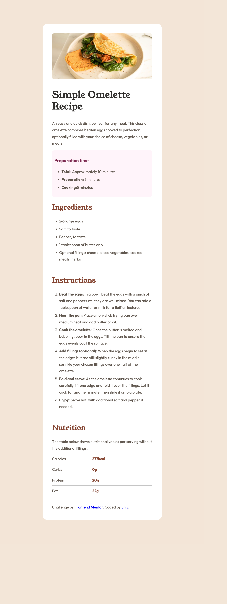
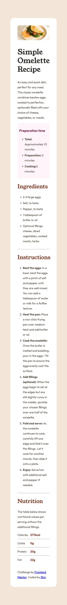

## Table of contents

- [Overview](#overview)
  - [The challenge](#the-challenge)
  - [Screenshot](#screenshot)
  - [Links](#links)
- [My process](#my-process)
  - [Built with](#built-with)
- [Author](#author)

## Overview

This recipe page was a front-end coding challange from FrontEnd Mentor. The technologies which were used, were HTML and CSS.

### Screenshot

### Links

- Solution URL: [Add solution URL here](https://your-solution-url.com)
- Live Site URL: [Add live site URL here](https://your-live-site-url.com)

## My process

- Step 1: Basic HTML structure
- Step 2: Upload all the assests, including custom fonts 
- Step 3: CSS structure
- Step 4: Edit ReadMe file
### Built with

- HTML
  - Class
- CSS
  - Class selector
  - Element selector  

## Author

- Website - [Shivam Agarwal](https://www.shivamagarwal.au)
- Frontend Mentor - [@undrthegraveyard](https://www.frontendmentor.io/profile/undrthegraveyard)
- Twitter - [@shivam_agarwaal](https://twitter.com/shivam_agarwaal)